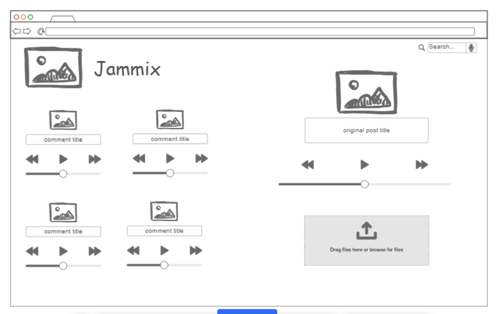
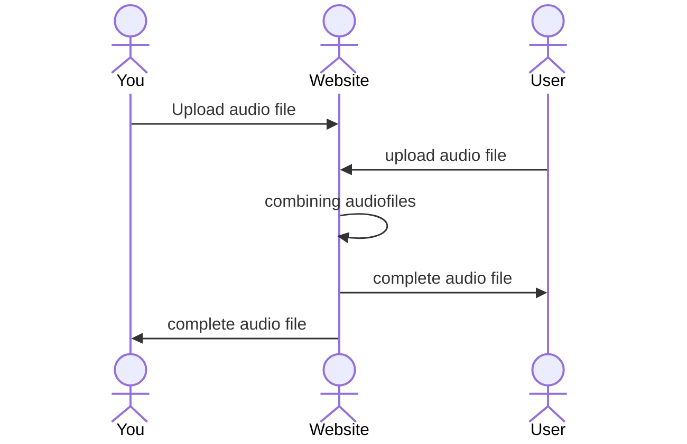

# Jammix

[My Notes](notes.md)

A music social media site in which users can combine their music or add onto anothers. They can then share this music on the site and let it be discoverable by others.

> [!NOTE]
>  This is a template for your startup application. You must modify this `README.md` file for each phase of your development. You only need to fill in the section for each deliverable when that deliverable is submitted in Canvas. Without completing the section for a deliverable, the TA will not know what to look for when grading your submission. Feel free to add additional information to each deliverable description, but make sure you at least have the list of rubric items and a description of what you did for each item.

> [!NOTE]
>  If you are not familiar with Markdown then you should review the [documentation](https://docs.github.com/en/get-started/writing-on-github/getting-started-with-writing-and-formatting-on-github/basic-writing-and-formatting-syntax) before continuing.

## 🚀 Specification Deliverable

> [!NOTE]
>  Fill in this sections as the submission artifact for this deliverable. You can refer to this [example](https://github.com/webprogramming260/startup-example/blob/main/README.md) for inspiration.

For this deliverable I did the following. I checked the box `[x]` and added a description for things I completed.

- [x] Proper use of Markdown
- [x] A concise and compelling elevator pitch
- [x] Description of key features
- [x] Description of how you will use each technology
- [x] One or more rough sketches of your application. Images must be embedded in this file using Markdown image references.

### Elevator pitch

Jammix will be an online site in which users can upload audio files of their instrument playing. Other users can then also upload their audiofiles, in a comment section type area, playing over the original upload from the root user. Then, the root user can choose to recognize another user's audio file as an official one, combining the two. For example, someone can upload an audiofile of a baseline. Then, two other users will "comment" their audiofiles of their drum lines. The bassist can then choose one of the drum lines to be the "official". Of course, you can still listen to all the uploads.

### Design

The design I'm working on will hopefully combine both audio and images to make it visually appealing. There could be a lot going on so its important to keep the User Interface as neat and uncomplicated as possible.

### Key features

- Uploading audio files
- Mixing audio files; or combining them at the very least
- Comment section of audio files; all public

### Technologies

I am going to use the required technologies in the following ways.

- **HTML** - Basic structural and organizational elements
- **CSS** - design, animating, UI
- **React** - login page, audio upload
- **Service** - login, API usage
- **DB/Login** - User files, info
- **WebSocket** - a new post is created by a user

## 🚀 AWS deliverable

For this deliverable, I learned a lot about how servers work, especially Amazon AWS servers. I learned what an elastic IP is and how they are used. I also learned about security keys and server sizes. However, there was a lot of options on the Amazon AWS page, so there is definitely more for me to learn in the future. Also, here is the command to ssh into the server from my local device: 
-  ssh -i [path to security key] ubuntu@3.88.140.178

- [x] **Server deployed and accessible with custom domain name** - [My server link](https://jammix.click).

## 🚀 HTML deliverable

For this deliverable I did the following. I checked the box `[x]` and added a description for things I completed.

- [x] **HTML pages** - I created 3 pages for the website that link to one another through HTML
- [x] **Proper HTML element usage** - I completed this part of the deliverable. My whole site is made with proper HTML
- [x] **Links** - I have a navigation bar at the bottom of the page that links to other pages in the website
- [x] **Text** - I have text descriptions of each post which will be written by the user when they upload
- [x] **3rd party API placeholder** - My API placeholder is on the create page. I'm going to use an API that allows for audio uploads.
- [x] **Images** - Each post, along with every profile, has a corresponding image associated with it.
- [x] **Login placeholder** - I have a login page placeholder where a user can login or create an account, which then leads to another registration page
- [x] **DB data placeholder** - I have a placeholder on my create account page for the database where i can store login information
- [x] **WebSocket placeholder** - I have a placeholder in my 'comment section' part of the explore page for websocket. That way, comments will update automatically.

## 🚀 CSS deliverable

For this deliverable I did the following. I checked the box `[x]` and added a description for things I completed.

- [x] **Header, footer, and main content body** - Every page has a header and main body. The explore page has a footer giving details about the page's creater (me).
- [x] **Navigation elements** - At the base of each page is a navigation bar that will always stay at the base of the page for easy access.
- [x] **Responsive to window resizing** - Items of the page will resize with an adjusted window.
- [x] **Application elements** - Elements were designed to make the UI easy to use for a new user.
- [x] **Application text content** - Text was designed to be easy to read and locate.
- [x] **Application images** - Images are used as buttons and each post has an image built into it. More specific images will replace the current placeholders when functionality is added to the site.

## 🚀 React part 1: Routing deliverable

For this deliverable I did the following. I checked the box `[x]` and added a description for things I completed.

- [x] **Bundled using Vite** - I installed Vite and bundled
- [x] **Components** - I added all the necessary components
- [x] **Router** - I added the routers to each page

## 🚀 React part 2: Reactivity deliverable

For this deliverable I did the following. I checked the box `[x]` and added a description for things I completed.

- [x] **All functionality implemented or mocked out** - You can now login and create posts. The posts will show up on your profile.
- [x] **Hooks** - Use hooks to track the current user and to navigate the site properly

## 🚀 Service deliverable

For this deliverable I did the following. I checked the box `[x]` and added a description for things I completed.

- [x] **Node.js/Express HTTP service** - I did not complete this part of the deliverable.
- [x] **Static middleware for frontend** - I did not complete this part of the deliverable.
- [x] **Calls to third party endpoints** - Every time the website enters the explore or login page, a new "song of the day" is accessed through an itunes API
- [x] **Backend service endpoints** - I did not complete this part of the deliverable.
- [x] **Frontend calls service endpoints** - I did not complete this part of the deliverable.
- [ ] **Supports registration, login, logout, and restricted endpoint** - I did not complete this part of the deliverable.

## 🚀 DB deliverable

For this deliverable I did the following. I checked the box `[x]` and added a description for things I completed.

- [ ] **Stores data in MongoDB** - I did not complete this part of the deliverable.
- [ ] **Stores credentials in MongoDB** - I did not complete this part of the deliverable.

## 🚀 WebSocket deliverable

For this deliverable I did the following. I checked the box `[x]` and added a description for things I completed.

- [ ] **Backend listens for WebSocket connection** - I did not complete this part of the deliverable.
- [ ] **Frontend makes WebSocket connection** - I did not complete this part of the deliverable.
- [ ] **Data sent over WebSocket connection** - I did not complete this part of the deliverable.
- [ ] **WebSocket data displayed** - I did not complete this part of the deliverable.
- [ ] **Application is fully functional** - I did not complete this part of the deliverable.
